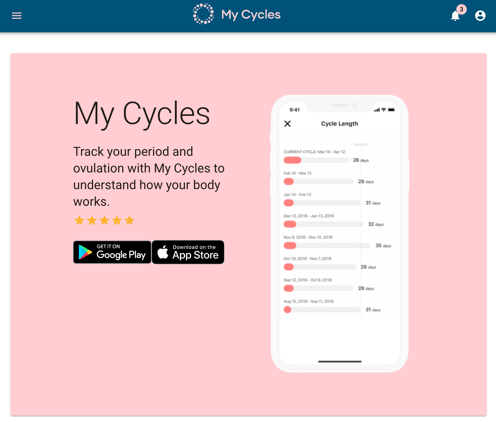
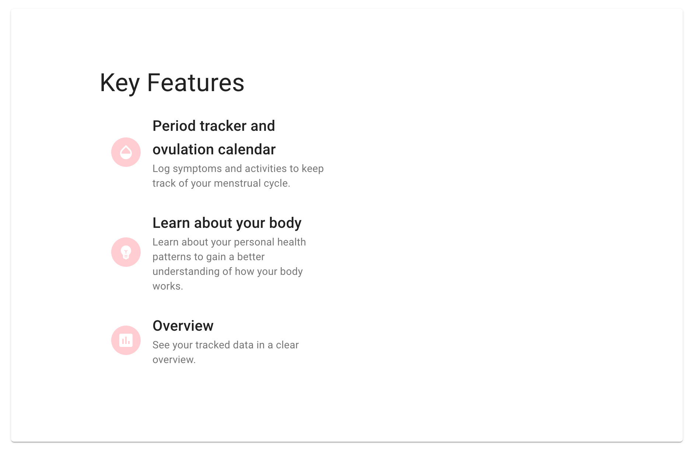
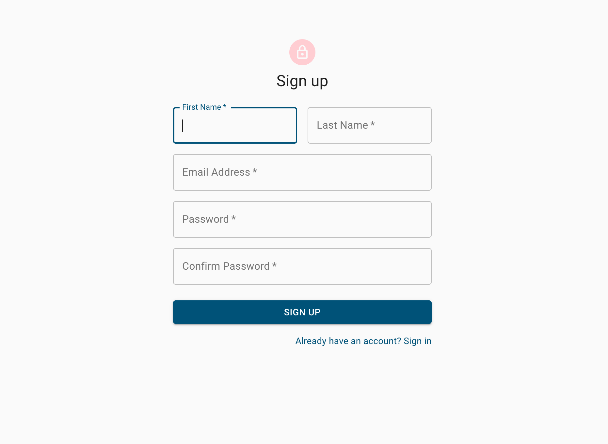
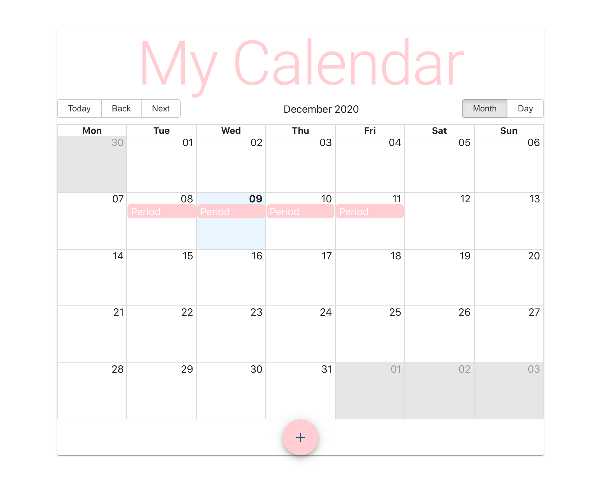
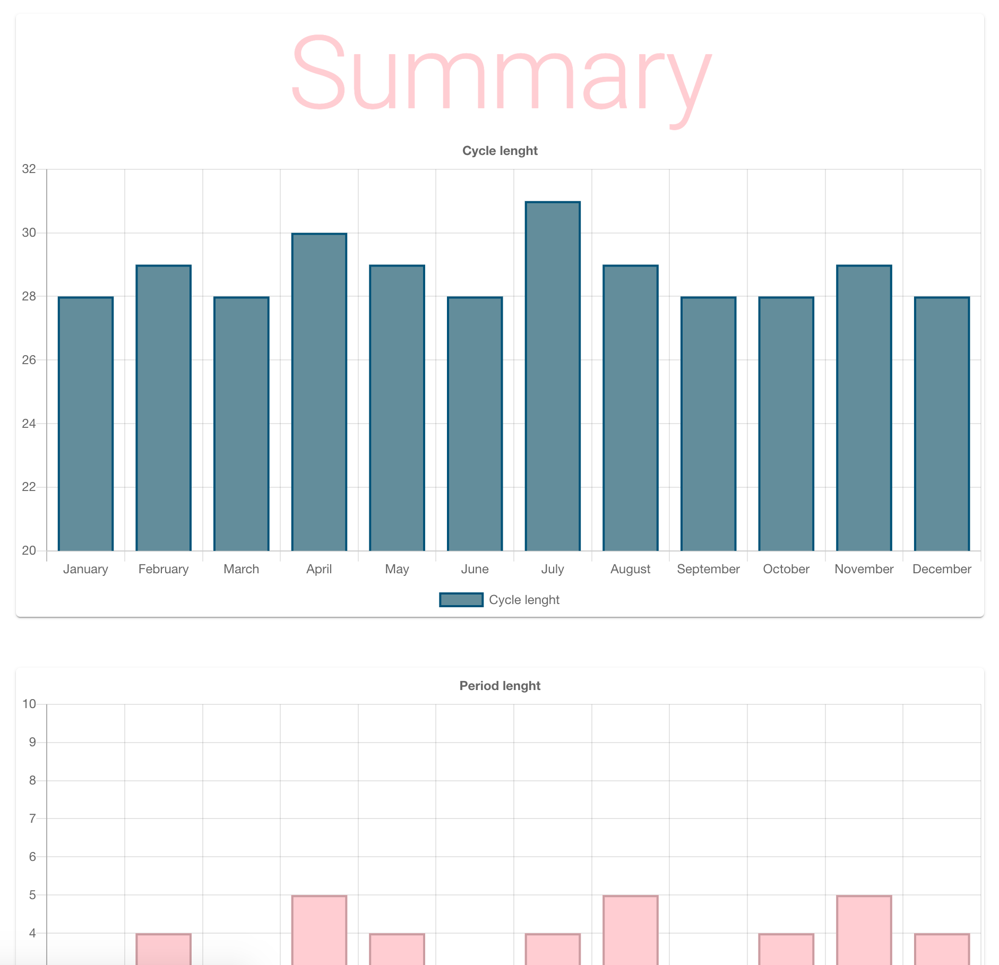

### My Cycles

### What is MyCycles?
My Cycles is a period tracker and ovulation calendar written with React and Firebase.

### Features
* register and login
* period tracking calendar
* summary dashboard

### Deploy Instructions
(1) install heroku CLI (only first time required)

(2) git push heroku master
